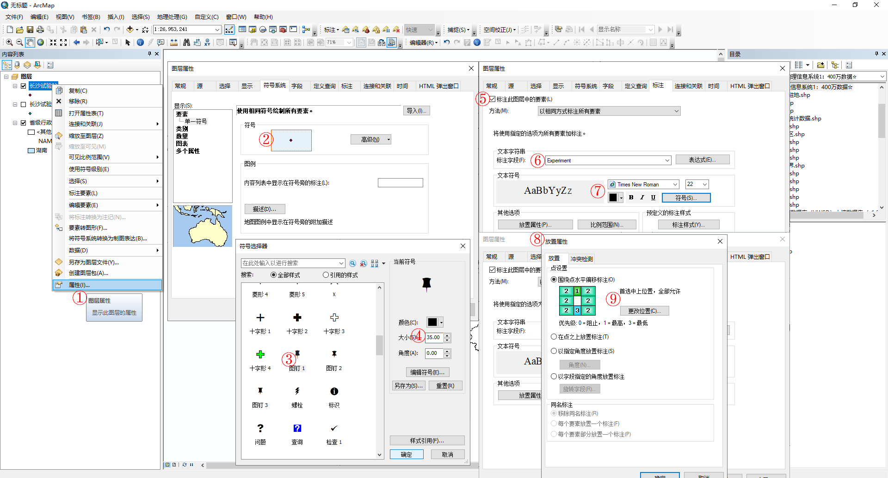
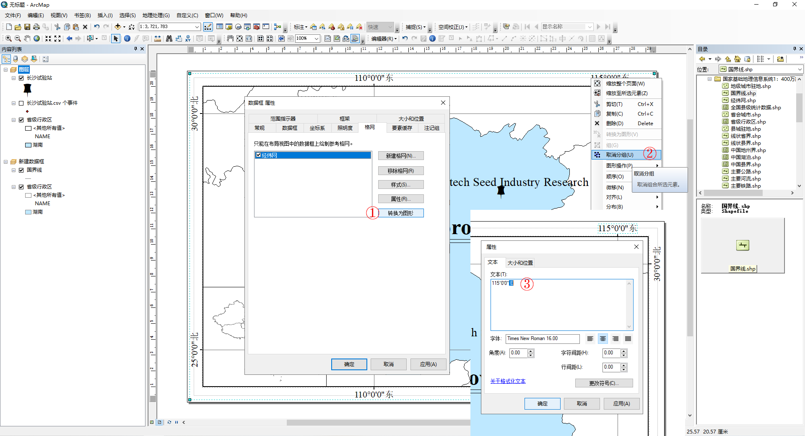
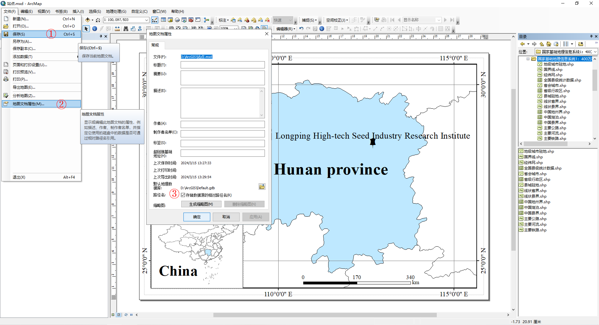

# 前期准备

## 安装AcrGIS

参照教程：[ArcGIS 10.8 for Desktop 完整安装教程](https://malagis.com/arcgis-desktop-10-8-full-installation-tutorial.html "ArcGIS 10.8 for Desktop 完整安装教程（含win7/8/10 32/64位+下载地址+亲测可用+汉化） | 麻辣GIS")，安装ArcGIS 10.8。

## 新建地图文档

双击打开ArcMap 10.8，新建地图文档。

查看并设置ArcGIS默认工作目录。

## 准备地图要素

中国省份地图要素资源可从网上获取，如[国家基础地理信息系统1：400万数据](http://www.igadc.cn/general/u1e84 "国家基础地理信息系统1：400万数据 - 东北亚地理科学数据中心")。将中国地图要素放置在ArcGIS默认工作目录下。

# 站点地图绘制

## 站点分布图（主图）

### 添加地图要素

可从工具条或目录窗口中添加要素文件，如此处的省级行政区shp文件。

或从目录窗口中拖动添加。

### 调整地图要素属性

添加的地图要素即成为地图文档中的图层。

-   调整省份颜色。在内容列表中，选中地图要素，双击或右键打开其图层属性。在符号系统中，依次点击 类别 - 唯一值，值字段 选择 `NAME`，点击 添加值，选择目标省份（如 `湖南`）。双击符号，自行调整样式参数，如此处将 其他所有值 对应的符号的填充颜色设为无，轮廓颜色为黑色；将 湖南 对应的符号的填充颜色设为方纳石蓝，轮廓颜色为黑色。

-   添加省份文字标注。

添加目标省份英文名称。右击要素图层，打开属性表，添加字段（添加一列文本，专用于目标省份的英文拼写）。

开始编辑，在相应位置填入身份英文名称，停止编辑并保存。

添加文字标注。打开图层属性 - 标注，勾选 *标注此图层中的要素*，标注字段 选择 英文名称所在的字段，调整文本格式。

### 制作并添加站点要素

-   新建站点经纬度csv文件，并保存在ArcGIS默认工作目录下。

应注意，经纬度要以度为单位。经纬度转换可自行计算或利用线上网站（如[在线经纬度转换工具](https://www.tiantianditu.com/tool/convert.html "在线经纬度转换工具_经纬度转度分秒格式_度分秒转经纬度格式 - 天天看地图")）完成。经纬度度分秒转换公式：度 = 度 + 分/60 + 秒/60/60。

-   制作研究站点要素并调整符号样式及显示文字标注。

设置数据框坐标系。双击或右键打开数据框（例如此处名为“图层”的数据框）的属性，坐标系选择 `GCS_WGS_1984`。

在AcrMap中，依次点击 文件 - 添加数据 - 添加XY数据，选中站点经纬度csv文件，将X、Y分别对应经度、纬度，确定导入。

右键csv图层，点击 数据 - 导出数据，设置导出路径及文件名称，导出站点要素文件（shp文件）并添加到地图中。

打开站点要素图层属性，符号系统 - 要素 - 单一符号，点击符号以调整样式；同时设置文字标注。其中，文字标注可以设置放置属性（如首选中上位置）。

-   调整主图布局。

切换到 布局视图。页面空白处，右键，打开 页面和纸张设置，将纸张方向设为横向。选中数据框，并在其属性中设置大小和位置。

切回 数据视图。将地图比例设为 `1:3,000,000` 左右，并手动拖动地图至合适位置（可随时切换至 布局视图 查看拖放效果）。

## 全国地图概况（副图）

加入中国地图。

-   新建数据框。在 布局视图 中，插入 - 数据框。将地图要素 国界线.shp 文件拖入新建数据框，将“图层”数据框中的 省级行政区 拖入新建数据框。将新建数据框中的所有图层符号的线条颜色设为灰色50%。

-   调整新建数据框属性。设置新建数据框的大小和位置、框架背景、坐标系等。

-   调整全国地图比例。切回 数据视图，将地图比例设为 `1:23,000,000` 左右，并手动拖动地图至合适位置（可随时切换至 布局视图 查看拖放效果）。

## 补充图件信息

在 布局视图 中，给主图添加指北针、比例尺、经纬格网等图件信息。

-   右键“图层”数据框 - 激活。菜单栏 插入 - 指北针/比例尺，选择样式并调整其属性，如图。

-   添加经纬格网。打开“图层”数据框属性，格网 - 新建格网，不断点击 下一页 ，直至 完成。之后，调整格网属性，如图。

将经纬度网格中的中文改为英文。转换为图形 - 确定。选中经纬网格图形，右键，取消组合两次。通过在目标文字上双击，手动更改。

-   添加中国地图文本。在 布局视图 中，将新建数据框置于顶层。之后，插入 - 文本，填写 `China`。

-   合理摆放地图图件。

# 地图保存

-   保存地图文档。地图文档属性，勾选 存储数据源的相对路径名。如此，ArcGIS地图文档及制图要素便可以打包转移至其他设备查看（要求地图文档和制图要素的相对位置不变）。

-   导出地图。

